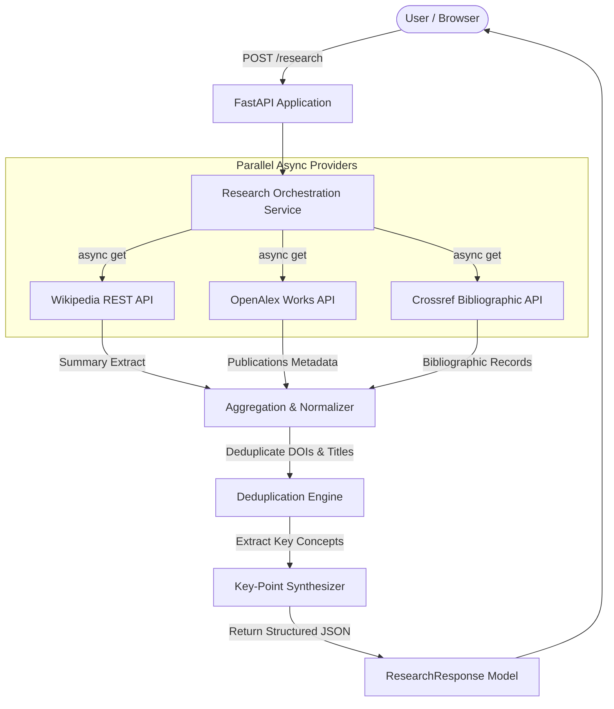

# ResearchLite — Automated Topic Research Microservice

> **Academic DevOps & Microservice Project**  
> An automated, resilient topic-research microservice built with **Python 3.12**, **FastAPI**, **Wikipedia REST API**, **OpenAlex Works API**, **Crossref API**, and **Docker**.

---

## 1. Project Overview

**ResearchLite** is a lightweight research microservice designed to accept an arbitrary research topic (e.g., *Quantum Computing*, *DevOps*, *Large Language Models*) and synthesize:
- **Topic Summary**: Introductory background extract fetched from Wikipedia.
- **Key Takeaways**: Deterministically extracted key concept points.
- **Academic Publications**: Scholarly research papers, publication years, authors, and DOI links retrieved and deduplicated from OpenAlex and Crossref.
- **Source Citations**: Canonical web and DOI reference links.
- **Resilience Warnings**: Non-blocking warning messages if an upstream academic provider experiences a timeout or outage.

---

## 2. Problem Statement & Motivation

Conducting preliminary literature reviews and domain research typically requires querying multiple distinct sources manually: encyclopedic overviews for general context and academic indices for peer-reviewed papers. 

**ResearchLite** solves this by acting as a single, consolidated research microservice that:
1. Concurrently queries open-access knowledge providers.
2. Deduplicates scholarly citations across multiple databases.
3. Provides fault tolerance: if one academic source is down or slow, the service still delivers partial results gracefully instead of failing with an HTTP 500 error.
4. Exposes both an interactive REST API (OpenAPI/Swagger) and a modern single-page browser frontend.

---

## 3. Technology Stack

| Layer | Technology | Purpose |
|---|---|---|
| **Language** | Python 3.12+ | Core programming runtime |
| **API Framework** | FastAPI | High-performance asynchronous REST API framework |
| **ASGI Web Server** | Uvicorn | High-throughput asynchronous server |
| **HTTP Client** | HTTPX | Asynchronous, non-blocking HTTP client for external APIs |
| **Data Validation** | Pydantic v2 | Strict schema validation, type checking, and serialization |
| **Research Sources** | Wikipedia + OpenAlex + Crossref | Public open-access knowledge and bibliographic APIs |
| **Containerization** | Docker | Portable, containerized runtime environment |
| **Testing** | Pytest + TestClient | Automated unit and integration testing suite |
| **Frontend** | HTML5 / CSS3 / Vanilla JS | Responsive, glassmorphic single-page research interface |

---

## 4. Architecture & Data Flow



---

## 5. Repository Structure

```text
ResearchHub/
├── app/
│   ├── __init__.py
│   ├── main.py                  # FastAPI app entry point, CORS, static mounting
│   ├── config.py                # Configuration and timeout settings
│   ├── api/
│   │   ├── __init__.py
│   │   └── routes.py            # Endpoints: /health, /research, /papers
│   ├── models/
│   │   ├── __init__.py
│   │   └── schemas.py           # Pydantic schemas (ResearchRequest, Paper, etc.)
│   ├── services/
│   │   ├── __init__.py
│   │   ├── wikipedia_service.py # Wikipedia async adapter & search fallback
│   │   ├── openalex_service.py  # OpenAlex academic works query adapter
│   │   ├── crossref_service.py  # Crossref bibliographic records adapter
│   │   └── research_service.py  # Orchestration, deduplication, key-point extraction
│   └── static/
│       └── index.html           # Single-page frontend user interface
├── tests/
│   ├── __init__.py
│   ├── test_health.py           # Health endpoint and static serving tests
│   ├── test_research.py         # Route integration and validation tests
│   └── test_providers.py        # Provider unit tests with mocked network calls
├── docs/
│   ├── development-plan.md      # Milestone and architecture planning
│   ├── architecture.md          # Detailed architecture specification & diagrams
│   ├── troubleshooting.md       # Local running and diagnostic guide
│   ├── viva.md                  # Comprehensive viva questions & answers
│   └── development-log.md       # Chronological development milestone records
├── Dockerfile                   # Python 3.12 slim container with healthcheck
├── .dockerignore                # Build context exclusion rules
├── requirements.txt             # Project dependencies
├── .env.example                 # Environment configuration template
├── .gitignore                   # Version control ignore rules
├── pytest.ini                   # Pytest async configuration
├── project.md                   # Formal academic project documentation
└── CHANGELOG.md                 # Semantic version changelog
```

---

## 6. Local Setup & Execution

### Prerequisites
- Python 3.12 or newer installed (`python --version`)
- Git

### Step-by-Step Instructions

1. **Clone or navigate to the repository directory:**
   ```bash
   cd ResearchHub
   ```

2. **Create and activate a virtual environment:**
   - **Linux / macOS:**
     ```bash
     python3 -m venv .venv
     source .venv/bin/activate
     ```
   - **Windows (PowerShell):**
     ```powershell
     python -m venv .venv
     .venv\Scripts\Activate.ps1
     ```

3. **Install dependencies:**
   ```bash
   pip install -r requirements.txt
   ```

4. **Run the FastAPI application:**
   ```bash
   uvicorn app.main:app --reload --host 0.0.0.0 --port 8000
   ```

5. **Access the Application:**
   - **Web Interface**: [http://localhost:8000](http://localhost:8000)
   - **Swagger Interactive API Docs**: [http://localhost:8000/docs](http://localhost:8000/docs)
   - **ReDoc API Documentation**: [http://localhost:8000/redoc](http://localhost:8000/redoc)
   - **Health Check Endpoint**: [http://localhost:8000/health](http://localhost:8000/health)

---

## 7. Docker Containerization

To run ResearchLite inside an isolated, production-like Docker container:

1. **Build the Docker Image:**
   ```bash
   docker build -t researchlite:1.0.0 .
   ```

2. **Run the Container:**
   ```bash
   docker run -d --name researchlite-app -p 8000:8000 researchlite:1.0.0
   ```

3. **Verify Container Status:**
   ```bash
   docker ps
   curl http://localhost:8000/health
   ```

4. **Stop and Clean Up:**
   ```bash
   docker stop researchlite-app
   docker rm researchlite-app
   ```

---

## 8. API Reference

### 8.1 Health Check
- **Endpoint**: `GET /health`
- **Description**: Verifies service status and build version.
- **Sample Response**:
  ```json
  {
    "status": "running",
    "service": "ResearchLite",
    "version": "1.0.0"
  }
  ```

---

### 8.2 Perform Topic Research
- **Endpoint**: `POST /research`
- **Header**: `Content-Type: application/json`
- **Request Body**:
  ```json
  {
    "topic": "Quantum Computing"
  }
  ```
- **Sample Response**:
  ```json
  {
    "topic": "Quantum Computing",
    "summary": "Quantum computing is a rapidly-emerging technology that harnesses the laws of quantum mechanics to solve problems too complex for classical computers.",
    "key_points": [
      "Quantum computing is a rapidly-emerging technology that harnesses the laws of quantum mechanics.",
      "Solves problems too complex for classical computers."
    ],
    "papers": [
      {
        "title": "Quantum supremacy using a programmable superconducting processor",
        "authors": ["Frank Arute", "John M. Martinis"],
        "year": 2019,
        "source": "OpenAlex",
        "url": "https://doi.org/10.1038/s41586-019-1666-5",
        "doi": "10.1038/s41586-019-1666-5"
      }
    ],
    "sources": [
      {
        "name": "Wikipedia",
        "title": "Quantum computing",
        "url": "https://en.wikipedia.org/wiki/Quantum_computing"
      },
      {
        "name": "OpenAlex",
        "title": "OpenAlex Works Index (5 publications)",
        "url": "https://openalex.org/works?search=Quantum+Computing"
      }
    ],
    "warnings": []
  }
  ```

---

### 8.3 Paper Search
- **Endpoint**: `GET /papers?topic=DevOps`
- **Description**: Retrieves deduplicated scholarly publications for a topic from OpenAlex and Crossref.
- **Sample Response**:
  ```json
  [
    {
      "title": "Continuous Delivery and DevOps: A Systematic Literature Review",
      "authors": ["Lianping Chen"],
      "year": 2018,
      "source": "OpenAlex",
      "url": "https://doi.org/10.1109/computer.2018.2888278",
      "doi": "10.1109/computer.2018.2888278"
    }
  ]
  ```

---

## 9. Automated Testing

The project includes an automated test suite with **12 tests** covering health endpoints, route validation, input sanitization, provider parsing, deduplication, and partial failure resilience.

Run tests using pytest:
```bash
python -m pytest tests/ -v
```

---

## 10. Fault Tolerance & Provider Resilience

The microservice employs asynchronous concurrency with `asyncio.gather(..., return_exceptions=True)`.

If one upstream provider fails (e.g. Crossref times out or Wikipedia is unreachable):
1. The error is captured as an exception object instead of bubbling up.
2. The remaining functional providers are aggregated into the response.
3. A clear warning message is appended to the `warnings` array.
4. The client receives an HTTP 200 with partial results rather than an HTTP 500 failure.

---

## 11. Viva Quick Reference

- **Why FastAPI?** Native asynchronous I/O (`async`/`await`), automated OpenAPI documentation generation, and high execution speed with Pydantic serialization.
- **Why HTTPX over Requests?** HTTPX supports non-blocking asynchronous requests (`AsyncClient`), enabling concurrent queries to Wikipedia, OpenAlex, and Crossref.
- **What is Deduplication in ResearchLite?** Eliminates duplicate citations appearing in both OpenAlex and Crossref using normalized DOIs and alphanumeric title hashing.
- **How is Container Isolation Achieved?** A lightweight Docker image (`python:3.12-slim`) packaged with explicit dependencies, running as a non-privileged `appuser`.
