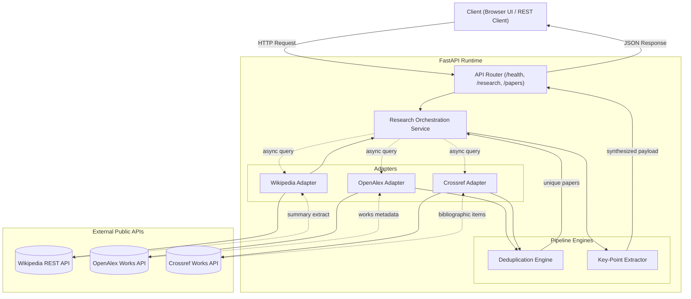
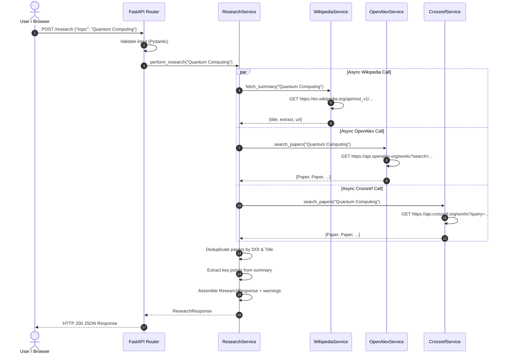
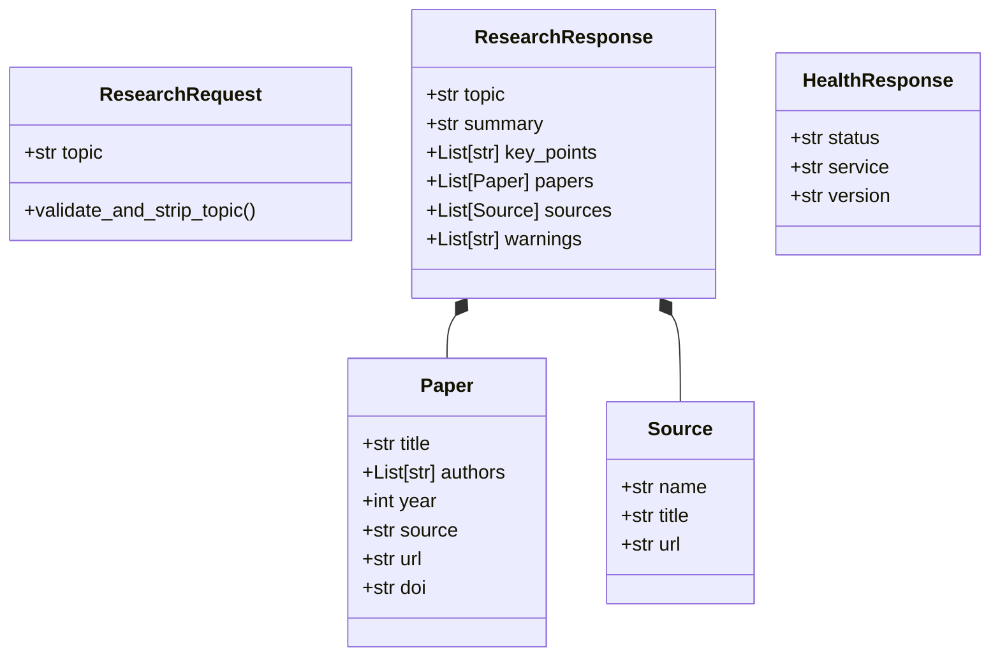

# ResearchLite — System Architecture & Specification

---

## 1. High-Level Architecture

ResearchLite is structured as a decoupled, asynchronous microservice that mediates between end-user clients and external knowledge registries.

---

## 2. Asynchronous Execution & Sequence Diagram

The following sequence diagram illustrates the lifecycle of a `POST /research` request:

---

## 3. Data Model Architecture

---

## 4. Resilience & Error Handling Architecture

The service adheres to the **Bulkhead and Fallback Pattern**:

1. **Isolation**: A slow or non-responsive provider does not exhaust thread pools because all operations run asynchronously on non-blocking event loops.
2. **Timeouts**: Every HTTP call is bounded by a client-level timeout (default: 10s).
3. **Graceful Fallback**: If an external provider returns an error, the exception is caught, added as a warning entry, and the response is served with the available data.
