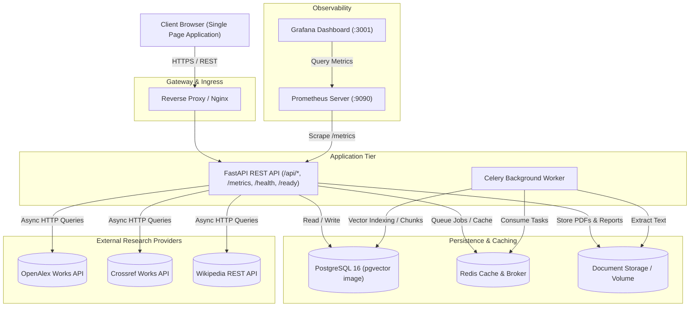
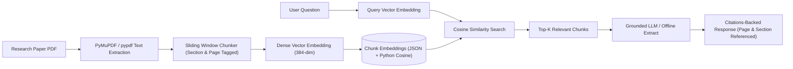

# ResearchOps AI — System Architecture & Specification

> **Intelligent Literature Research, Paper Analysis & DevOps Platform**  
> Scalable, observable architecture with FastAPI, PostgreSQL (pgvector-ready image), Redis, Celery, Docker, Prometheus, and RAG-based document intelligence.

---

## 1. High-Level Multi-Service Architecture

---

## 2. RAG Document Intelligence Pipeline

---

## 3. Data Entities & Schema Topology

- **ResearchProject**: Workspaces grouping papers, notes, chats, comparisons, and literature reviews.
- **Paper**: Canonical bibliographic records with DOI and title normalization deduplication.
- **PaperDocument**: Ingested PDFs with checksum validation, file metadata, and extraction lifecycle states (`pending`, `processing`, `ready`, `failed`).
- **PaperChunk**: Overlapping text passages tagged with page numbers and detected academic section headings.
- **PaperSummary**: Standardized 16-parameter empirical research summary.
- **ChatSession & ChatMessage**: Multi-turn dialogue with JSON-serialized source citation pills.
- **ExportReport**: Multi-format generated artifacts (PDF, DOCX, Markdown, JSON, BibTeX).
- **BackgroundJob**: Distributed Celery task tracker for long-running extractions.
- **DeploymentRecord & AuditEvent**: DevOps release tracking and operational audit trail.

---

## 4. Observability & DevOps Resilience

1. **Liveness Probe (`GET /health`)**: Checks process responsiveness.
2. **Readiness Probe (`GET /ready`)**: Asserts database and worker queue operational state.
3. **Prometheus Exporter (`GET /metrics`)**: Exposes DB-backed gauges (papers, documents, chunks, projects, active jobs) and measured provider probe latencies.
4. **Graceful Provider Degradation**: Isolated timeouts prevent single academic provider failures from halting user research queries.
5. **Build Metadata**: Control Center surfaces version/commit/build info (no simulated container rollback).
